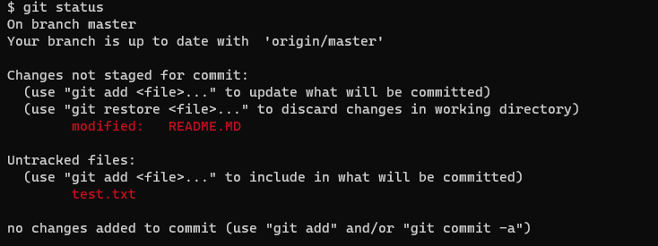
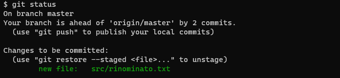
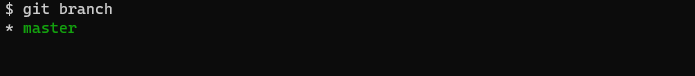

# Corso git

## Indice

<!-- TOC -->
* [Corso git](#corso-git)
  * [Indice](#indice)
  * [01 git init](#01-git-init)
  * [02 git clone](#02-git-clone)
  * [03 git status](#03-git-status)
    * [Stati possibili](#stati-possibili)
      * [Unmodified](#unmodified)
      * [Modified](#modified)
      * [Untracked](#untracked)
  * [04 git add](#04-git-add)
    * [Staged](#staged)
  * [05 git commit](#05-git-commit)
  * [Esercizio 1](#esercizio-1)
    * [Consegna](#consegna)
  * [06 git rm](#06-git-rm)
    * [Eliminazione file](#eliminazione-file)
    * [Eliminazione file solo da git](#eliminazione-file-solo-da-git)
  * [07 git mv](#07-git-mv)
    * [Rinominare un file](#rinominare-un-file)
    * [Spostare un file](#spostare-un-file)
  * [08 git reset](#08-git-reset)
  * [09 git checkout](#09-git-checkout)
  * [10 git restore](#10-git-restore)
  * [11 git remote](#11-git-remote)
  * [12 git fetch](#12-git-fetch)
  * [13 git pull](#13-git-pull)
  * [14 git push](#14-git-push)
  * [15 git branch](#15-git-branch)
  * [Soluzioni](#soluzioni)
    * [Soluzione Esercizio 1](#soluzione-esercizio-1)
<!-- TOC -->

## 01 git init

Creiamo il nostro primo repository git:

* [Scarica il progetto da qui](01-git-init/01-git-init.zip)
* Scompatta il progetto
  con [windows esplora risorse](https://support.microsoft.com/it-it/windows/comprimere-e-decomprimere-file-f6dde0a7-0fec-8294-e1d3-703ed85e7ebc)
  , [7z](https://www.7-zip.org/download.html) o [tramite terminale (unzip)](https://linux.die.net/man/1/unzip)
* Entra nella cartella `01-git-init`, contiente lo scheletro di un progetto java
* Apri [git bash](https://gitforwindows.org/) o il tuo terminale preferito :computer: [nella cartella](https://www.toolsqa.com/git/common-directory-commands-on-git-bash/#:~:text=Open%20Git%20Bash%20directly%20in%20the%20folder&text=For%20this%2C%20go%20to%20the,%3D%3E%20Open%20Git%20Bash%20here.) 
* Digita `git init`
* Hai inizializzato il tuo primo repository! :partying_face:

Digita `ls -a` o apri esplora risorse, noterai che c'è una nuova cartella :new: `.git`    
   
Questa conterrà tutte le informazioni necessarie per versionare il nostro repository.

[:arrow_up: indice](#indice) - [prossima sezione :arrow_heading_down:](#02-git-clone)

## 02 git clone

Copiamo un repository esistente nel nostro pc, tramite git:

* Andiamo ad aprire [questo repository GitHub](https://github.com/dc-zerob/01-git-init) :globe_with_meridians:
* Apriamo esplora risorse in una nuova cartella
* Apriamo git bash in questa cartella :computer:
* Digitiamo `git clone https://github.com/ikatyang/emoji-cheat-sheet.git`
* Ora abbiamo scaricato lo stesso progetto che abbiamo aperto poco fa sul browser

Se entriamo nella cartella `emoji-cheat-sheet`, notiamo come prima cosa che c'è già una cartella `.git`.   
Ciò significa che questo progetto è stato precedentemente inizializzato con `git init` e poi reso disponibile online.

Dunque non ci sarà bisogno di dover inizializzare manualmente questo progetto come
spiegato [nella sezione precedente](#01-git-init)).

[:arrow_up: indice](#indice) - [prossima sezione :arrow_heading_down:](#03-git-status)

## 03 git status

* Apriamo il progetto [precedentemente scaricato](#02-git-clone)
* Apriamo git bash :computer:
* Digitiamo `git status`
  

Ci da subito 3 informazioni   
:one: Il branch in cui siamo `master`    
:two: Il nostro branch è allineato con `origin/master`    
:three: Non abbiamo nulla da aggiungere `nothing to commit, working tree clean`

### Stati possibili

#### Unmodified

Al momento siamo nello stato `Unmodified`, non abbiamo modificato e non abbiamo aggiunto file.

#### Modified

* Apriamo il file :pencil: `README.MD` e modifichiamo il titolo
* Salviamo il file :floppy_disk:
* Digitiamo `git status`, ora siamo nello stato `Modified`
  

#### Untracked

* Aggiungiamo un nuovo file `test.txt`
* Verifichiamo con `git status`
      
  Come notiamo dall'immagine, abbiamo il file precedente `README.MD` in stato _Modified_ e il nostro nuovo
  file `test.txt` in stato _Untracked_.     
  Dunque, git ci sta dicendo che il file `test.txt` non è versionato nel repository e non terrà traccia delle modifiche.

[:arrow_up: indice](#indice) - [prossima sezione :arrow_heading_down:](#04-git-add)

## 04 git add

Analizziamo l'ultimo stato, ovvero *Staged*, aggiungendo il file `test.txt` in stato _Untracked_ al repository git.

* Digitiamo `git add test.txt`
* Controlliamo con `git status`
  

Leggendo la console, git ci comunica che il file è pronto per essere committato (nella sezione _Changes to be
committed_) e viene dichiarato da git come nuovo (_new file_).    
Questo perchè stiamo aggiungendo un file che non era presente nel repository.

### Staged

Sappiamo che il file è in stato _Staged_ perchè si trova nel primo punto: **Changes to be committed**. :heavy_check_mark:

Viceversa, il file `README.MD` è in stato _Modified_ ma non in _Staged_, infatti si trova nel secondo punto:
**Changes not staged for commit**. :x:

Proviamo a modificare il file:

* Apriamo il file :pencil: `test.txt` e scriviamo `test`
* Salviamo il file :floppy_disk:
* Facciamo una verifica con :computer: `git status`
  

Troviamo il nostro file in due punti:

1. _Changes to be committed_
2. _Changes not staged for commit_

Questo perchè git traccia la versione del file precedente alla nostra modifica.   
Se vogliamo aggiungere le modifiche appena salvate, bisognerà digitare nuovamente `git add test.txt`

Ora abbiamo un solo file sotto la voce _Changes to be committed_, che include le nostre modifiche.

[:arrow_up: indice](#indice) - [prossima sezione :arrow_heading_down:](#05-git-commit)

## 05 git commit

Siamo pronti per versionare le nostre modifiche e dunque fare il nostro primo commit.

* Digitiamo  :computer: `git commit -m "aggiunto file di test"`
    * Tramite il flag `-m` definiamo il messaggio per il nostro commit
* Verifichiamo con `git status`
  

Ora abbiamo salvato e dunque **committato** le nostre modifiche.   
Controllando la console, git ci comunica che abbiamo "1 commit in più" (_ahead of ... by 1 commit_), dunque il commit è
stato creato correttamente.

Andiamo a salvare anche le modifiche al file `README.MD`

* Aggiungiamo il file `git add README.MD`
* Committiamo con `git commit -m "aggiornato readme"`
* Controlliamo: `git status`

Abbiamo completato il nostro secondo commit :white_check_mark:.    
Git ci avvisa tramite la console: _ahead of 'origin/master' by 2 commit_.

[:arrow_up: indice](#indice) - [prossima sezione :arrow_heading_down:](#esercizio-1)

## Esercizio 1

### Consegna

1. Aggiungi un nuovo file `nome.txt`
    * Scrivi nel file il tuo nome e salvalo
    * Aggiungi un commit
2. Aggiungi un altro file: `cellulare.txt`
    * Scrivi nel file la marca del tuo cellulare
    * Aggiungi un commit 

**Ricorda di verificare lo stato del tuo repository dopo ogni passaggio!**

Una volta completato, puoi verificare [la soluzione qui.](#soluzione-esercizio-1)

[:arrow_up: indice](#indice) - [prossima sezione :arrow_heading_down:](#06-git-rm)

## 06 git rm

### Eliminazione file

Abbiamo aggiunto un file che doveva essere eliminato, rimuoviamolo con `git rm`.

* Rimuoviamo il file `README.MD`
* Eseguiamo il comando `git rm README.MD`
  
* Verifichiamo il nostro repository con `ls -a`

  
    * Il file è stato rimosso dal nostro progetto e da git.
    * Possiamo committarlo (in quanto il file si trova in _Changes to be committed_)
* Versioniamo le modifiche: `git commit -m "rimosso readme"`

### Eliminazione file solo da git

Vediamo ora come eliminare un file solamente da git, senza cancellarlo dal nostro progetto.

* Aggiungiamo un nuovo file `nuovo.txt`
* Spostiamolo in `Staged` con: `git add nuovo.txt`
* Creiamo un commit `git commit -m "nuovo file"`
* Rimuoviamo ora il file solo da git `git rm --cached nuovo.txt`
  

Nuovamente, troviamo il nostro file in due posizioni:

* _Changes to be committed_: Qui il file verrà eliminato da git, infatti git ci dice che è **deleted**.
* **Untracked files**: Come abbiamo visto con [git status](#untracked), i file untracked non verranno versionati da git.

Dunque il nostro file non verrà più preso in considerazione da git, ma non verrà eliminato dal nostro pc.    
Salviamo la modifica con un commit: `git commit -m "rimosso file nuovo da git"`

[:arrow_up: indice](#indice) - [prossima sezione :arrow_heading_down:](#07-git-mv)

## 07 git mv

### Rinominare un file

* Creiamo un nuovo file: `da_rinominare.txt`
* Aggiungiamolo a git: `git add da_rinominare.txt`
* Rinominiamo il file: `git mv da_rinominare.txt file_rinominato.txt`
* Verifichiamo lo stato: `git status`

* Ora controlliamo il filesystem

    
Il file è stato correttamente rinominato.

### Spostare un file

Questo comando ci permette inoltre di spostare un file da una cartella ad un altra.

* Spostiamo il file rinominato dentro **src**: `git mv rinominato.txt src`
* Git riconosce che il file è stato spostato nella cartella **src**
  
* Controlliamo il filesystem con `ls` e `ls src`
  

Il file non è più presente nella cartella principale del nostro progetto, è stato spostato correttamente dentro `src`.

[:arrow_up: indice](#indice) - [prossima sezione :arrow_heading_down:](#08-git-reset)

## 08 git reset

Rimuoviamo un file aggiunto in area di staging:

* Controlliamo lo stato del repository `git status`

* Abbiamo il file `src/rinominato` disponibile
* Rimuoviamo il file dalla _staging area_: `git reset HEAD src/rinominato`
  * `HEAD` indica l'ultimo commit del nostro repository locale.
* Andiamo a verificare: `git status`

Il file è stato rimosso corretamente e lo ritroviamo sotto la voce `Untracked files`.

Se volessimo togliere i file dall'area di stage e annullare le modifiche fatte potremmo usare il flag `--hard`.

* Aggiungiamo nuovamente i file: `git add nuovo.txt src/rinominato.txt`
* Aggiungiamo un commit `git commit -m "aggiunto nuovo.txt e rinominato.txt"`
* Controlliamo il repository: `git status`

* Modifichiamo ora i file :pencil: `nuovo.txt` e `rinominato.txt` e salviamoli :floppy_disk:
* Eseguiamo ora il comando :computer: `git reset --hard HEAD`
  * In questo caso non indichiamo il file perchè andiamo ad annullare le modifiche di tutto il repository
* `git status`

Siamo nella stessa situazione in cui eravamo post commit.    
Questo perchè tutti i file del repository sono stati rimossi dall'area di stage e le loro modifiche sono state annullate.

[:arrow_up: indice](#indice) - [prossima sezione :arrow_heading_down:](#09-git-checkout)

## 09 git checkout

Tramite git reset abbiamo annullato le modifiche per tutto il repository, annulliamo ora le modifiche fatte ad un solo file.

* Apriamo il file :pencil: `nuovo.txt` e salviamolo :floppy_disk:
* Facciamo lo stesso per `src/rinominato.txt` e salviamolo :floppy_disk:
* :computer: `git status`

* Annulliamo le modifiche solo di `nuovo.txt`: `git checkout -- nuovo.txt`
* :computer: `git status`

Le modifiche fatte al file `src/rinominato.txt` sono rimaste, mentre il file `nuovo.txt` non contiene più le nostre modifiche.

[:arrow_up: indice](#indice) - [prossima sezione :arrow_heading_down:](#10-git-restore)

## 10 git restore

I comandi precedentemente spiegati sono risultati complessi, e poco intuitivi per i nuovi (a volte anche per i veterani) utenti di git, [visto che possono eseguire moltissime operazioni oltre a quelle spiegate fin'ora](https://stackoverflow.com/a/58003889/5533075). 
Se volete saperne di più, vi consiglio di approfondirli sulla guida ufficiale:
* [git reset](https://git-scm.com/docs/git-reset)
* [git checkout](https://git-scm.com/docs/git-checkout)

Per semplificare i due comandi e restringere le operazioni che possono svolgere, sono stati introdotti vari comandi tra cui [git restore](https://git-scm.com/docs/git-restore). Vediamo come rimuovere il file dall'area di stage con questo comando:

* Aggiungiamo il file `src/rinominato.txt` nella staging area: `git add src/rinominato.txt`
* Ora rimuoviamolo tramite il nuovo comando restore: `git restore --staged file`
* :computer: `git status`

Ripristiniamo il file dopo averlo modificato:
* Apriamo il file :pencil: `src/rinominato.txt` e salviamolo :floppy_disk:
* Ripristiniamo il file: `git restore src/rinominato.txt`

Abbiamo visto come ottenere gli stessi risultati che abbiamo visto prima con [git reset](#08-git-reset) e con [git checkout](#09-git-checkout) usando un solo comando e semplificando le operazioni.

[:arrow_up: indice](#indice) - [prossima sezione :arrow_heading_down:](#11-git-remote)

## 11 git remote

Il repository su cui abbiamo lavorato nelle sezioni precedenti è stato clonato nella sezione [02 git clone](#02-git-clone).
Andiamo ad approfondire come git usa il link che abbiamo copiato tramite `git remote`.

* :computer: `git remote -v`

Abbiamo 3 informazioni:    
:one: Origin, è il nome di default assegnato da git al nostro `remote` quando eseguiamo il comando `git clone <url>`, un alias univoco per il remote.   
:two: L'url che abbiamo copiato per la git clone, indica in maniera univoca il repository remoto.    
:three: fetch/push indica la modalità con cui andiamo a scaricare/caricare dati nel repository, approfondiremo più avanti questa parte.

Possiamo aggiungere o rimuovere i nostri remote tramite appositi comandi:

* Aggiungiamo un remote fittizio tramite: `git remote add <alias> <url>`
* Dunque eseguiamo :computer: `git remote add mioRemote  https://github.com/mio-remote/mio-progetto.git`
* Andiamo a vedere i nostri remote: `git remote -v`

* Rimuoviamo il remote fittizio tramite: `git remote remove <alias>`
* Dunque lanciamo il comando :computer: `git remote remove mioRemote`
* :computer: `git remote -v`

[:arrow_up: indice](#indice) - [prossima sezione :arrow_heading_down:](#12-git-fetch)

## 12 git fetch

Il comando `git fetch` scarica le informazioni del repository remoto definito nel nostro `remote` senza applicarle.
E' ciò che permette a [git status](#03-git-status) di identificare i commit nuovi o mancanti rispetto al `remote` definito.

Per questa casistica andiamo a simulare che qualcuno abbia aggiunto un commit al repository spostandoci nella storia di git:

* Cloniamo il progetto: `git clone https://github.com/zerob-it/01-git-init-fetch.git`
* Eseguiamo questo script: `git reset --hard HEAD^1`
* Lanciamo il comando di fetch `git fetch`
* Ora controlliamo con: `git status`

Git ha scaricato le informazioni dal repository e nota che ci manca 1 commit, le modifiche di quel commit non sono ancora presenti sul nostro filesystem.    
Ci suggerisce di usare `git pull` che vediamo nella prossima sezione.

[:arrow_up: indice](#indice) - [prossima sezione :arrow_heading_down:](#13-git-pull)

## 13 git pull

Includiamo le modifiche scaricate da git-fetch nel nostro repository:
* :computer: `git pull`
* Verifichiamo con: `git status`

L'output del comando `git pull` ci avvisa che il file `README.MD` è stato modificato e ora il nostro repository e allineato.

Tipicamente possiamo usare direttamente `git pull` per scaricare informazioni dal repository remoto e nuovi commit, ["sotto al cofano"](https://git-scm.com/docs/git-pull) esegue `git fetch` e poi aggiorna il filesystem (`git merge`).

[:arrow_up: indice](#indice) - [prossima sezione :arrow_heading_down:](#14-git-push)

## 14 git push

Rendiamo disponibili le nostre modifiche a tutti, effettuando una push.

* Cloniamo un nuovo repository: `git clone https://github.com/zerob-it/01-git-init-push.git`
* Apriamo il progetto nel browser [qui](https://github.com/zerob-it/01-git-init-push)
* Apriamo il progetto con esplora risorse o con l'IDE
* Aggiungiamo un file con il nostro nome nelle cartella `src/main/resources`, e scriviamo all'interno la data odierna.
* Spostiamo il file nella staging area, es: `git add nome.txt`
* Commit: `git commit -m 'aggiunto il file nome`
* Ora rendiamo disponibile il file a tutti: `git push`
* Verifichiamo nel browser il nostro file, entrando nella cartella `src/main/resources`

[:arrow_up: indice](#indice) - [prossima sezione :arrow_heading_down:](#15-git-branch)

## 15 git branch

Tramite il comando [git-branch](https://git-scm.com/docs/git-branch) possiamo visualizzare il branch corrente o crearne di nuovi.
* Guardiamo il branch in cui siamo: `git branch`

* Creiamo un nuovo branch: `git branch nuovo`
* Verifichiamo il branch creato: `git branch`

Vediamo ora due branch, il primo **in verde** con un **asterisco** a sinistra, rappresenta il branch in cui siamo.
Il secondo in bianco, rappresenta il branch appena creato.

### Cambiare branch

Per spostarci di branch possiamo usare il comando di [checkout](https://git-scm.com/docs/git-checkout).
* Cambiamo branch: `git checkout nuovo`
* Controlliamo il branch: `git branch`

Come evidenziato dalla console, il branch attuale è il branch: `nuovo`.

_Si possono unire queste due operazioni in un comando unico tramite [git-checkout](https://git-scm.com/docs/git-checkout): `git checkout -b nomebranch`_

[:arrow_up: indice](#indice) - [prossima sezione :arrow_heading_down:](#16-git-merge)

## Soluzioni

### Soluzione Esercizio 1

* Creiamo il file `nome.txt`
    * Scriviamo nel file `marco` e salviamolo
    * Aggiungiamo il file al repository `git add nome.txt`
    * Commit: `git commit -m "aggiunto il file nome"`
* Creiamo il file cellulare `cellulare.txt`
    * Scriviamo all'interno `samsung`
    * Aggiungiamo il file al repository `git add cellulare.txt`
    * Creiamo il commit: `git commit -m "aggiunto il file cellulare"`

[:arrow_up: indice](#indice) - [:arrow_up: Esercizio 1 :clipboard:](#esercizio-1)

